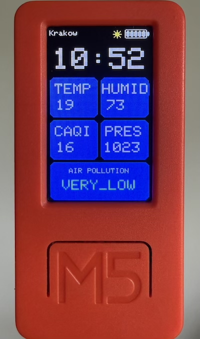

# M5StickC Plus Air Quality Monitor

A firmware for the **M5StickC Plus** that displays real-time air quality data from the [Airly API](https://airly.org/), a live clock, and battery status.



## Hardware Requirements

- **M5StickC Plus** (ESP32-based, 135×240 TFT, AXP192 PMU)
- USB-C cable for flashing and power
- Wi-Fi network (2.4 GHz)

## Software Requirements

- [PlatformIO](https://platformio.org/) (CLI or VS Code extension)
- Python 3.x (used by PlatformIO toolchain)

## Dependencies

Managed automatically by PlatformIO:

| Library | Version |
|---|---|
| M5StickCPlus | ^0.1.0 |
| ArduinoJson | ^7.0.0 |

## Configuration

Copy the example secrets file and fill in your credentials:

```bash
cp src/secrets.h.example src/secrets.h
```

Then edit `src/secrets.h` with your Wi-Fi credentials and Airly API key:

```cpp
const char* ssid = "YOUR_WIFI_SSID";
const char* password = "YOUR_WIFI_PASSWORD";
const char* apikey = "YOUR_AIRLY_API_KEY";
```

Get a free Airly API key at [developer.airly.org](https://developer.airly.org/). The free tier provides **100 requests per day**, which is more than enough since the device only fetches data every 15 minutes (96 requests/day).

**Note:** Location is automatically detected via IP geolocation on boot. Time zone defaults to CET (GMT+1) with daylight saving; adjust `gmtOffset_sec` and `daylightOffset_sec` in `src/main.cpp` if needed.

## Installation & Firmware Upload

1. Clone the repository:
   ```bash
   git clone <repo-url>
   cd Airly
   ```

2. Connect the M5StickC Plus via USB-C.

3. Build and upload:
   ```bash
   pio run -t upload
   ```

4. Monitor serial output (optional):
   ```bash
   pio device monitor -b 115200
   ```

## Features

### Air Quality Display

- **Live clock** — large HH:MM display, synced via NTP (`pool.ntp.org`), updates every minute
- **4 data tiles** showing:
  - **TEMP** — temperature (°C)
  - **HUMID** — humidity (%)
  - **CAQI** — Common Air Quality Index
  - **PRES** — atmospheric pressure (hPa)
- **Air pollution level** — bottom bar showing the pollution level text with a color matching the Airly CAQI color scale
- **Rate limit handling** — shows "RATE LIMIT REACHED / Try again tomorrow" when the daily Airly API quota (100 requests/day) is exhausted; retains last known data if already fetched
- **Data refresh** — fetches new data every 15 minutes
- **Placeholder UI** — gray tiles with "--" values and a "Loading..." indicator shown before first data arrives

### Status Bar

- **Screen title** — displays city name if available, otherwise "AIR QUALITY"
- **Brightness indicator** — yellow sun icon with current level (1–5)
- **Battery indicator** — 5-segment battery icon with color coding (red = critical, yellow = low, white = normal)

### Controls

| Button | Action |
|---|---|
| **Button A** (front) | Cycle brightness (5 levels: 10, 30, 50, 75, 100) |

## Project Structure

```
Airly/
├── platformio.ini       # PlatformIO project configuration
├── LICENSE              # MIT License
├── src/
│   ├── main.cpp         # Firmware source code
│   ├── secrets.h        # Your credentials (git-ignored)
│   └── secrets.h.example# Template for secrets.h
├── include/             # Header files (unused)
├── lib/                 # Project-specific libraries (unused)
└── test/                # Unit tests (unused)
```

## Airly API Integration

The firmware uses the [Airly REST API v2](https://developer.airly.org/docs) to fetch real-time air quality measurements for the device's location.

- **Free tier** — 100 requests/day (no credit card required; [register here](https://developer.airly.org/))
- **Refresh interval** — every 15 minutes (96 requests/day, well within the daily limit)
- **Endpoint** — `GET /v2/measurements/point?lat={lat}&lng={lng}` returns current PM2.5, PM10, temperature, humidity, pressure, and the CAQI index with a color-coded pollution level
- **Location** — resolved automatically on boot via IP geolocation (`ip-api.com`); no manual lat/lng configuration needed
- **Rate limit tracking** — the firmware reads the `X-RateLimit-Remaining-Day` response header; if the quota is exhausted it shows a "RATE LIMIT REACHED" placeholder instead of retrying
- **Offline resilience** — the last successfully fetched data remains on screen until the next successful refresh

## Troubleshooting

- **Screen blinking** — usually caused by rapid API re-fetches; the firmware guards against this with a 15-minute backoff timer
- **pyserial termios error on macOS with Python 3.14** — install pyserial from git: `pip install git+https://github.com/pyserial/pyserial.git`
- **Rate limit reached on first boot** — the device will show the placeholder screen; data will auto-refresh when the Airly daily quota resets (midnight UTC)

## License

This project is licensed under the [MIT License](LICENSE).
